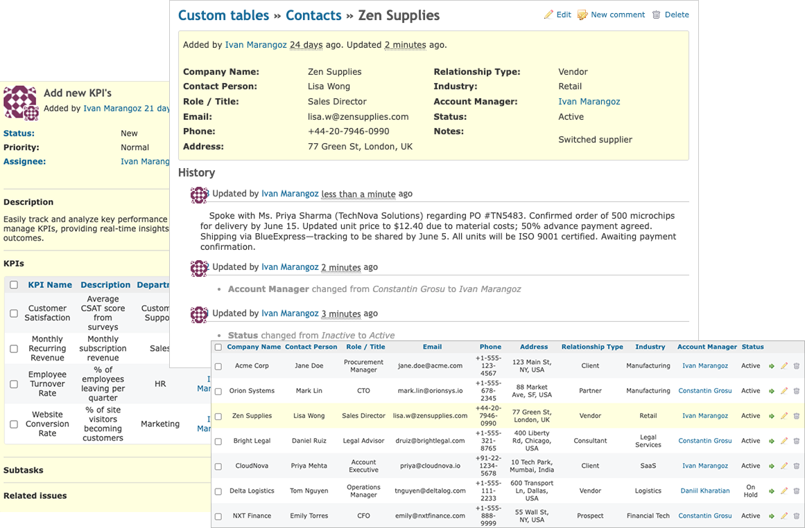

Redmine Custom Tables
==================

This plugin provides a possibility to create custom tables. The table is built with Redmine custom fields. It allows you to create any databases you need for your business and integrate it into your workflow processes.



[Online demo](https://redmineplus.com/sign-up-to-redmine-plus/)
* **login:** admin
* **password:** admin 

Features
-------------
* Table constructor
* Filtering 
* Sorting 
* Grouping
* Integration with issues
* History of changes
* Commenting entities
* Export CSV/PDF
* API

Compatibility
-------------
* Redmine 5.0.0 or higher

Installation and Setup
----------------------

* Clone or [download](https://github.com/frywer/custom_tables/archive/master.zip) this repo into your **redmine_root/plugins/** folder

```
$ git clone https://github.com/frywer/custom_tables.git
```
* If you downloaded a tarball / zip from master branch, make sure you rename the extracted folder to `custom_tables`
* You have to run the plugin rake task to provide the assets (from the Redmine root directory):
```
$ bundle exec rake redmine:plugins:migrate RAILS_ENV=production
```
* Restart redmine

Usage
----------------------
1) Visit **Administration->Custom tables** to open table constructor. 
2) Press button **New table**. Fill the name field, select projects you want to enable table on and submit the form.
3) Add custom fields to your new table.
4) Give access to the users **Administration -> Roles and permissions -> Project -> Manage custom tables**